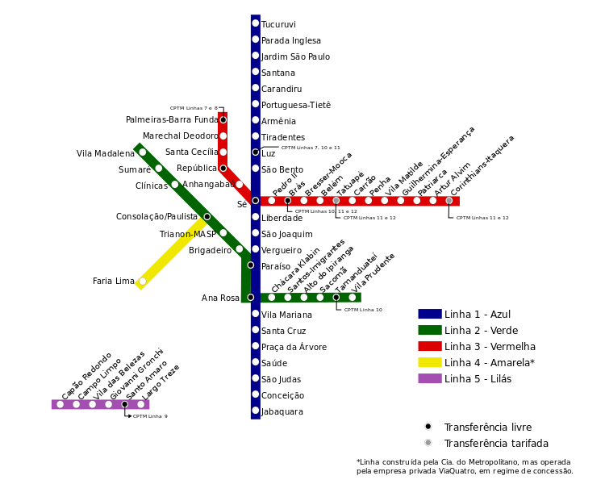
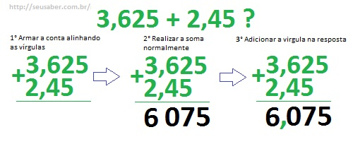

# Aula 01 - Introdução

## Por que é legal programar?

1. Autonomia: criar ferramentas, automatização e parametrização
2. Você trabalha mais no processo e menos no resultado
3. Racionalização do processo criativo
4. Geração de possibilidades
5. Expandir o espaço das ideias

## Programar é sobre se comunicar

Aprender a programar, é aprender uma forma nova de se comunicar e nesse caso inicialmente se comunicar com a máquina. Uma vez que você aprende alguns princípios dessa comunicação, fica um pouco mais fácil de se expressar em diversas linguagens de programação.

Para saber mais sobre esse conceito: [Programar nunca foi sobre Código](https://www.youtube.com/watch?v=eLnLevR5mjg)

## Pensamento computacional

> “a utilização de  conceitos  fundamentais  da  computação
para resolver  problemas,  projetar  sistemas, e  compreender
comportamentos humanos”  — [Jeannette  Wing citada por Eduardo Omine](http://www.teses.usp.br/teses/disponiveis/16/16134/tde-12092014-122450/pt-br.php)

De uma forma bem simples e genérica o pensamento computacional é aplicar alguns conceitos que são muito comuns e diários do universo das ciências computacionais a outros campos e situações.

Destaco **4 conceitos** importantes para se começar a programar:

### Abstração

Identificar e extrair o mais relevante de um problema ou informação. Exemplos: números, mapas, agenda, etc.

<figure>
  
  <figcaption>Mapa do Metrô de São Paulo: Fonte <a href="https://commons.wikimedia.org/wiki/File:Mapa_metro_sp.svg">Wikipedia</a></figcaption>
</figure>

### Algoritmo

Criar uma série de instruções para resolver uma tarefa e tarefas similares. Exemplos: operações matemáticas (somar, dividir, multiplicar, etc), receita de bolo, jogadas de futebol, etc.

<figure>
  
  <figcaption>Operação de adição com números decimais. Fonte: <a href="http://seusaber.com.br/matematica/como-fazer-contas-de-somar-com-virgula.html">Seu saber</a></figcaption>
</figure>

### Decomposição

Decompor o problema/informação em porções menores. Exemplos: uma rota para se chegar a um local, estabelecer um cronograma baseado no tempo gasto em cada uma das etapas, entender o como uma bicicleta funciona a partir de suas peças, etc.

### Parametrização

Estabelecer variáveis de controle sobre uma solução ou ferramenta. Exemplos: controle de volume ou equalizador em um player ou caixa de som, registro da torneira, etc.

(Este é um conceito que não encontrei dessa forma nas bibliografias, mas achei importante ressaltar aqui)

## Estudos de caso

Uma seleção de projetos interessantes que utilizam da programação para criar peças visuais. Nem todos casos aqui selecionados utilizam o NodeBox como ferramenta.

// Pegar lista da apresentação

## Aula 01 - Demonstrações

Arquivos criados durante ou para demonstração nas aulas práticas

## Aula 01 - Exercício

1. Explorando as primitivas básicas e o nó grid criar um padrão geométrico.
2. Criar uma composição livre utilizando as transformações e o nó copie.

### Desafio:

Recriar o resultado abaixo com parametrização do número de colunas e linhas, ou seja ao mudar a quantidade de colunas ou linhas, o padrão deve se ajustar automaticamente
